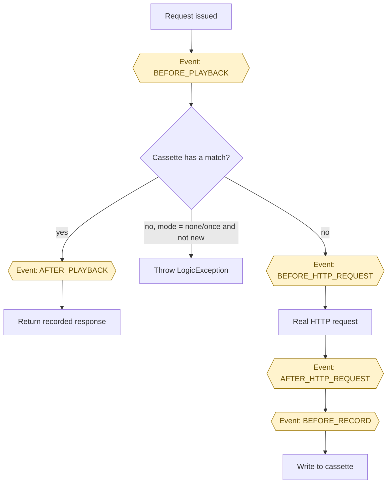
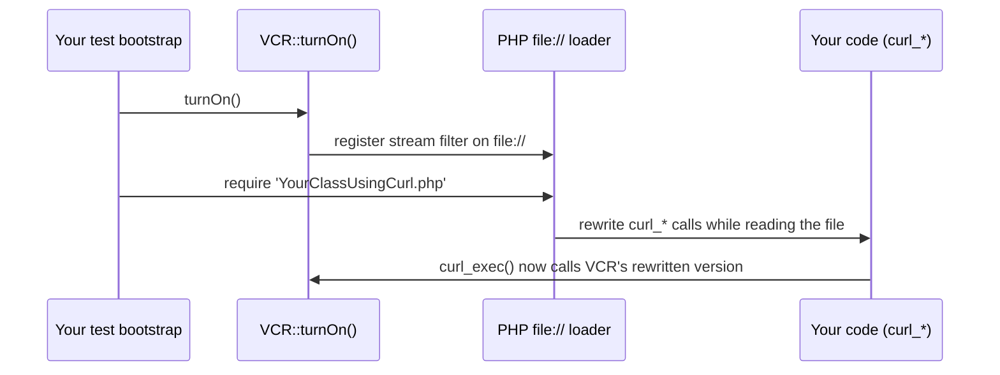

# How VCR Works

> One-liner: PHP has no monkey-patching, so php-vcr intercepts HTTP two different ways depending on which
> library issues the request — and both ways care a lot about *when* you call `turnOn()`.

**On this page:** [The request flow](#the-request-flow) · [Two interception mechanisms](#two-interception-mechanisms) · [Why turnOn() must run early](#why-turnon-must-run-early) · [The require/include constraint](#the-requireinclude-constraint) · [Whitelist/blacklist](#whitelistblacklist)

## The request flow

Every intercepted request goes through the same dispatcher, regardless of which hook caught it:



Hexagon nodes are dispatched events — see the [Events reference](../reference/events.md) for their payloads
and how to listen for them. Library hooks are disabled for the duration of step H — otherwise php-vcr would
try to intercept its own outbound request.

## Two interception mechanisms

- **`stream_wrapper`** replaces PHP's `http`/`https` stream wrapper globally
  (`stream_wrapper_unregister('http')` + `stream_wrapper_register('http', ...)`). Any function that goes
  through it — `fopen()`, `file_get_contents()` — is intercepted automatically, no matter where the call is
  written.
- **`curl` and `soap`** can't be intercepted that way — there's no "curl stream wrapper" to replace. Instead,
  php-vcr rewrites your PHP source **as it's loaded**: `Util\StreamProcessor` registers itself as the
  `file://` stream wrapper (the one PHP's own loader uses for `include`/`require`), and
  `CurlCodeTransform`/`SoapCodeTransform` run as `php_user_filter`s on top of it, swapping `curl_*` calls and
  `new SoapClient(...)` for VCR-aware equivalents as each file is opened for inclusion.



## Why turnOn() must run early

Because the `curl`/`soap` mechanism rewrites source **at load time**, it can only affect files that are still
unread when `turnOn()` runs. Call it right after Composer's autoloader, before anything that might call
`curl_*` or construct a `SoapClient` gets loaded:

```php
// tests/bootstrap.php
require __DIR__ . '/../vendor/autoload.php';
\VCR\VCR::turnOn();
\VCR\VCR::turnOff();
```

The immediate `turnOff()` isn't a typo: `turnOn()` is what triggers the registration above, and that
registration is permanent for the rest of the process — `turnOff()` only flips the hooks back to passthrough,
it doesn't undo it. So this pair gets the registration done early without leaving hooks live for the whole
run; each test calls `turnOn()` again (cheaply — the registration already happened) only when it actually
wants a cassette.

> **⚠️ Warning:** `StreamProcessor::intercept()` also disables opcache (`opcache.enable=0`). Opcache caches
> compiled bytecode, which would defeat source rewriting entirely — don't try to re-enable it around the
> hooks.

## The require/include constraint

One consequence of "rewrite at load time" is easy to miss: **the top-level script PHP was invoked with is
never rewritten**, even if it calls `curl_*` directly and `turnOn()` ran at its very top. This isn't a
php-vcr limitation — PHP's engine fully reads and compiles the entry script before any of that script's own
code (including a `turnOn()` call inside it) has a chance to run, so registering a stream filter from within
that same file can't retroactively affect it.

In practice this is a non-issue: real test suites always load test code via an autoloader or `require`
(PHPUnit, Codeception, …), never by writing `curl_*` calls directly in the file passed to the `php` binary.
The `stream_wrapper` hook has no such restriction, since it intercepts at the protocol level rather than by
rewriting source.

## Whitelist/blacklist

Scanning every loaded file for `curl`/`soap` calls has a cost. Narrow it with
[`setWhiteList()`/`setBlackList()`](../reference/configuration.md#white---blacklist) — paths are matched as
substrings, and a file is only scanned if it's in the whitelist (or the whitelist is empty) **and** not in
the blacklist. The default blacklist excludes php-vcr's own internals, to avoid infinite recursion.

---
← [Requirements](../requirements.md) · Next: [Cassettes](cassettes.md) →
