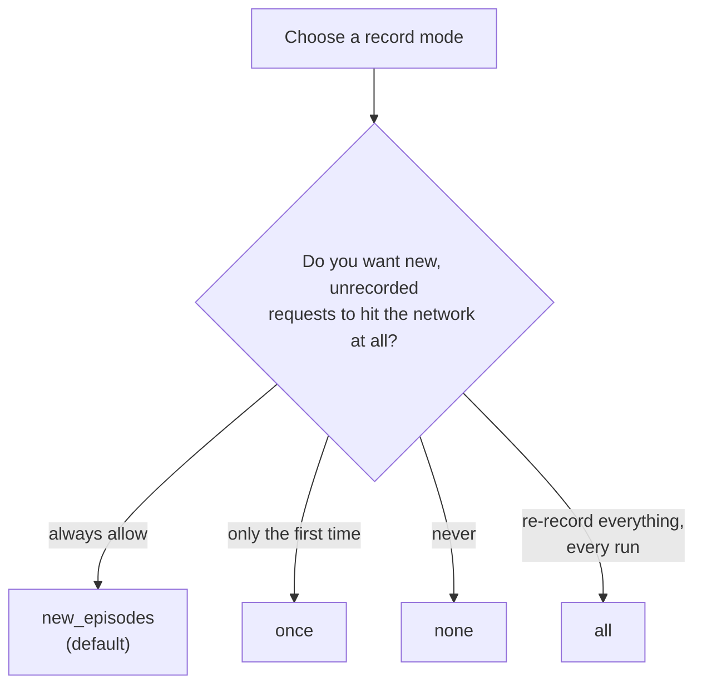

# Record Modes

> One-liner: the record mode decides whether an unmatched request is allowed to hit the network — pick the
> mode by how strict you want your test suite to be about network access.

**On this page:** [Which mode?](#which-mode) · [new_episodes](#new_episodes) · [once](#once) · [none](#none) · [all](#all)

Set via [`setMode()`](../reference/configuration.md#mode), using the
[`VCR::MODE_*`](../reference/vcr-facade.md#mode-constants) constants.

## Which mode?



## `new_episodes`

**Default.** Plays back a recorded interaction if one matches; performs the real HTTP request for anything
that doesn't, and records it. Every run can add new recordings — nothing ever throws for a new request.

```php
\VCR\VCR::configure()->setMode(\VCR\VCR::MODE_NEW_EPISODES); // or omit — it's the default
```

Good default for local development; less good for CI, where you usually want tests to fail loudly if they
try to reach the real network unexpectedly.

## `once`

Plays back recorded interactions. Allows new (unmatched) requests **only on the cassette's first run** — once
a cassette file exists with content, any further unmatched request throws `\LogicException`.

```php
\VCR\VCR::configure()->setMode(\VCR\VCR::MODE_ONCE);
```

This is the practical middle ground: the first time a test runs (or after deleting the cassette), it records
freely; every run after that is fully offline and any new/changed request is caught immediately as a test
failure instead of silently hitting the network.

## `none`

Read-only. Any request that doesn't match a recording throws `\LogicException` — even on a brand-new
cassette.

```php
\VCR\VCR::configure()->setMode(\VCR\VCR::MODE_NONE);
```

Use this once you've committed cassettes and want a hard guarantee that a test suite never performs a real
HTTP request, ever.

## `all`

Re-record mode. Never plays back — always performs the real HTTP request and records fresh. The cassette is
**purged on `insertCassette()`**, so every run starts from empty.

```php
\VCR\VCR::configure()->setMode(\VCR\VCR::MODE_ALL);
\VCR\VCR::turnOn();
\VCR\VCR::insertCassette('my_cassette'); // existing recordings are purged immediately
file_get_contents('http://example.com'); // always a real request, always re-recorded
\VCR\VCR::eject();
```

> **⚠️ Warning:** a run under `all` that performs no HTTP request leaves an **empty** cassette — that's
> inherent to "purge first, then re-record," not a bug.

- **Requires** a storage that implements `PurgeableStorageInterface` — all three built-in backends
  ([`yaml`](../reference/storage-backends.md#yaml), [`json`](../reference/storage-backends.md#json),
  [`blackhole`](../reference/storage-backends.md#blackhole)) do.

---
← [Cassettes](cassettes.md) · Next: [Request Matching](request-matching.md) →
